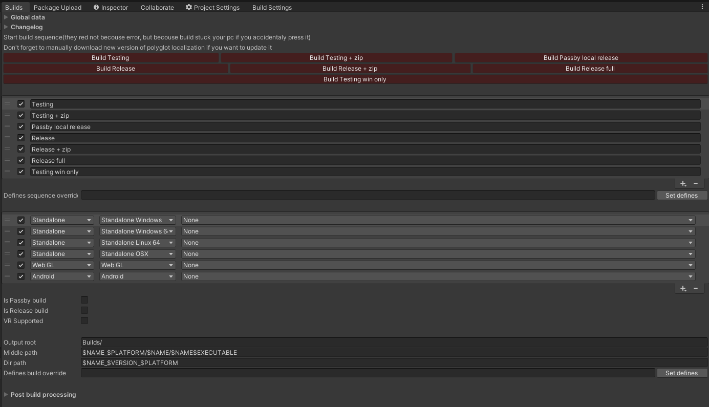
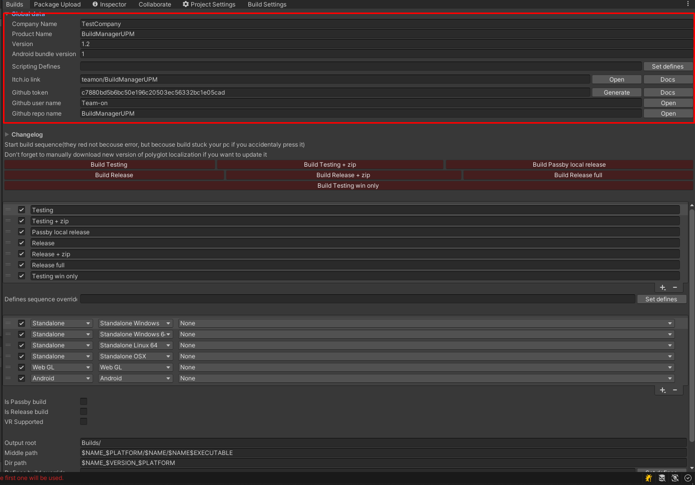
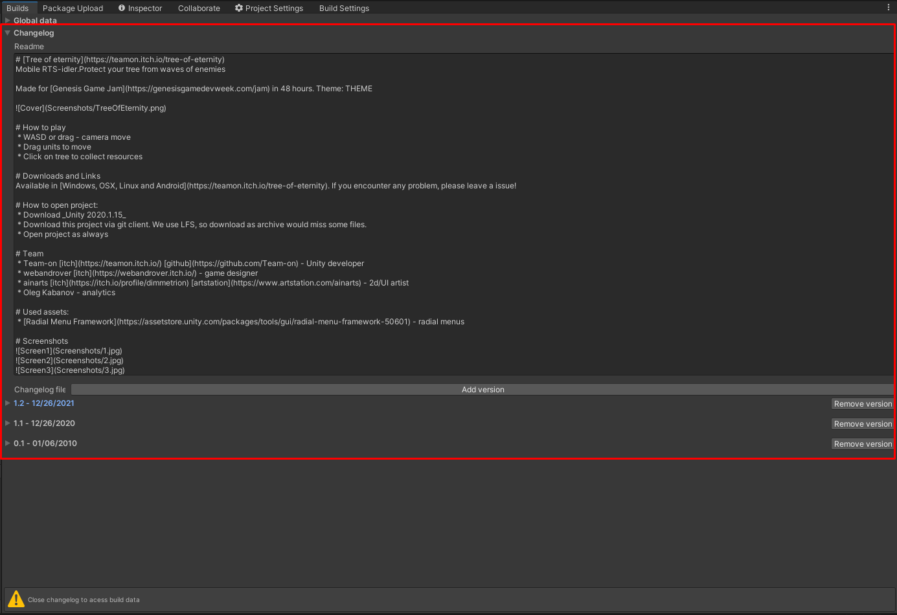
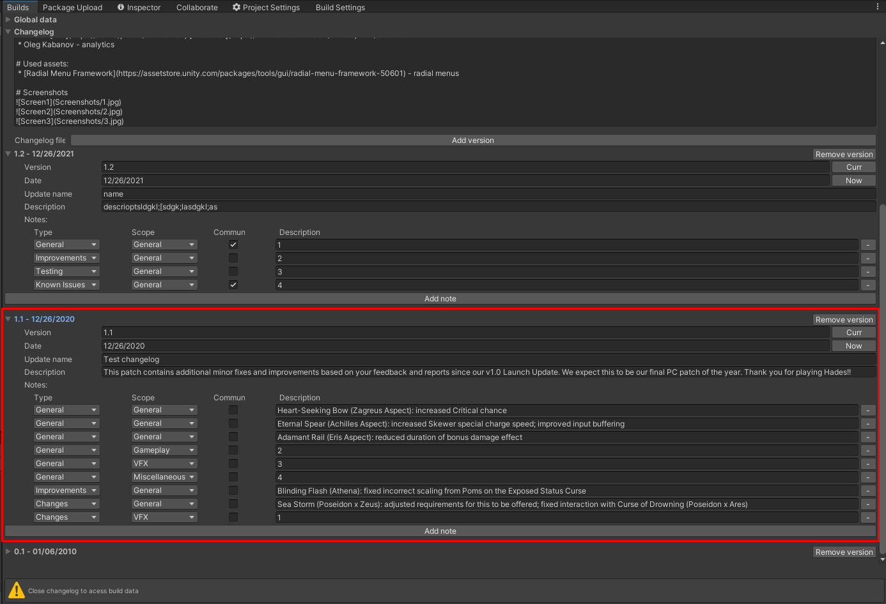

# Build & Changelog manager

## Description
Utility for running builds sequence &amp; pushing them to itch.io and github

'Build & Changelog manager' is an asset that can:
 * Run multiple builds
 * Archivate build
 * Push build to itch.io
 * Push build to Github releases
 * Auto optimize release builds for better performace and testing builds for faster build time
 * Maintain defines and options for each build and sequence
 * Keep changelog and readme files
 * Auto add changelog and readme to game folders
 
Also it nicely integrated with [Team-on Unity game template](https://github.com/Team-on/UnityGameTemplate)
 
 
## Editor window & how to use it
  
Here are main(and only one) Build manager window. Open it in *Windows/BuildManager/Builds window* or *Alt+B*. Lets look into it step by step

---------------------

### Global data
  
First foldout is responsible for global data, that usually setuped once or before major builds.
 - *Company name*, *Product name*, *Version*, *Android bundle version* and *Scripting defines* is just a shortcut for *PlayerSettings*
 - *Itch.io link* - required data for itch.io pushing. You can press on *Docs* to get how to generate that and *Open* to open your game page
 - *Github token* - token with **read, write:packages and delete:packages** access. You can press on *Generate* to get how to generate that and *Docs* to look how that work
 - *Github user name* - github user or group name
 - *Github repo name* - repository name

---------------------

### Build buttons
 
Here are buttons that run build sequences. There are one button for each sequence. You can hide button by disabling sequence

---------------------

### Sequence general
 
This is sequence settings. Here you can enable/disable sequnce via chechbox, change it name and add/remove sequences.

---------------------

### Sequence settings
 
This is global sequence data. Currently you can only add more *Scripting defines* to specific sequence. It would be added to defines written in *Global data*

---------------------

### Build settings
 
This is build settings group. Here you can enable/disable build via chechbox, change it name, select target and set build settings.  
For each build you can set this data:
 - *Passby build checkmark* - Use previously builded folder and just pass that to post build processing
 - *Release build checkmark* - Apply release optimizations for build. When unchecked - optimized for faster building
 - *VR build checkmark* - enable VR for build
 - *Output root* - Output root path
 - *Middle path* - Output specific path. Support variables
 - *Dir path* - path to directory that will be *archived* and pushed to *itch.io*. Support variables
 - *Defines build override* - add more *Scripting defines* to specific build. It would be added to defines written in *Global data* and *Sequence settings*
 
List of supported variables for path:
 - $NAME - product name with all separator replaced by '_'
 - $PLATFORM - platform
 - $VERSION - PlayerSettings.bundleVersion
 - $DATESHORT - [last 2 digits of year] [month] [day]
 - $YEARSHORT - last 2 digits of year
 - $DATE - [year] [month] [day]
 - $YEAR - year
 - $MONTH - month
 - $DAY - day
 - $TIME - [hour] [minute]
 - $EXECUTABLE - platform-specific executable. E.g. .exe for windows, .apk for android...
 
Post build processing:
 - *Compress* - create .zip archive
 - *Push to github releases* - use data from *Global data* to push build to github releases
 - *Push to itch.io* - use data from *Global data* to push build to itch.io
 - *itch.io channel* - channel for itch.io
 
---------------------

### Changelog general
 
This is changelog foldout. You need to close it, to access builds window back. Here you can do 2 things.
 - 1) Write Readme.txt file. This file will be included to build folder for standalone platforms.
 - 2) Keep and update changelog. It will automatically parse and created nice looking file that ill be included to build folder for standalone platforms.

---------------------

### Changelog version
 
So how to keep your changelog? Press on *Add version* - add new version.
For each version you can:
 - *Remove version*
 - Set version number
 - Set version date
 - Set short update name
 - Write description about update
 - *Add changelog notes*. You can select for them *Type*, *Scope*, check mark is this *community suggested* feature and add *description*
 - *Remove note*

---------------------

### Updating CLI
 
Build manager automatically download CLI for each platform in first use, but never updates it. You can update it manually in *Windows/BuildManager/Download X*


## Installation
### (For Unity 2018.3 or later) Using OpenUPM  
This package is available on [OpenUPM](https://openupm.com).  
You can install it via [openupm-cli](https://github.com/openupm/openupm-cli).  
```
openupm add com.teamon.buildmanager
```

### (For Unity 2018.3 or later) Using Git
Find the manifest.json file in the Packages folder of your project and add a line to `dependencies` field.
`"com.teamon.buildmanager": "https://github.com/Team-on/UnityBuildManager.git"`
Or, use [UpmGitExtension](https://github.com/mob-sakai/UpmGitExtension) to install and update the package.

### For Unity 2018.2 or earlier
1. Download a source code zip this page
2. Extract it
3. Import it into the following directory in your Unity project
   - `Packages` (It works as an embedded package. For Unity 2018.1 or later)
   - `Assets` (Legacy way. For Unity 2017.1 or later)
   
### From Unity Asset Store
1. https://assetstore.unity.com/packages/slug/188940
2. Add it to project as usual
